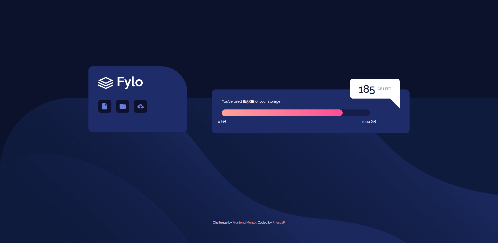
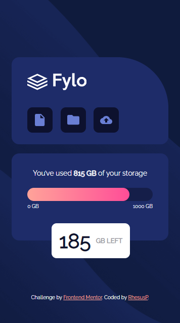

# Frontend Mentor - Fylo data storage component solution

This is a solution to the [Fylo data storage component challenge on Frontend Mentor](https://www.frontendmentor.io/challenges/fylo-data-storage-component-1dZPRbV5n). Frontend Mentor challenges help you improve your coding skills by building realistic projects. 

## Table of contents

- [Overview](#overview)
  - [The challenge](#the-challenge)
  - [Screenshot](#screenshot)
  - [Links](#links)
- [My process](#my-process)
  - [Built with](#built-with)
  - [What I learned](#what-i-learned)
- [Author](#author)


## Overview

### The challenge

Users should be able to:

- View the optimal layout for the site depending on their device's screen size

### Screenshot


**My desktop version**


<br>

**My mobile version**


### Links

- Solution URL: [https://www.frontendmentor.io/solutions/fylo](https://www.frontendmentor.io/solutions/fylo-website-using-flexbox-reoVZG-9B)
- Live Site URL: [camillebernot.xyz/portfolio/Fylo/](https://camillebernot.xyz/portfolio/Fylo/)

## My process

### Built with

- HTML5
- CSS3
- Flexbox


### What I learned

I learned how to customize progress bar's style thanks to webkit. 

```css
progress {
    webkit-appearance: none;
    [...]
}

progress::-webkit-progress-bar {
    [...]
}
```

I also learned how to make a gradient.

```css
progress::-webkit-progress-value {
    [...]
    background: linear-gradient(90deg, rgba(255,163,153,1) 0%, rgba(255,77,151,1) 100%);
}

```

## Author

- Website - [camillebernot.xyz](https://camillebernot.xyz)
- Frontend Mentor - [@RhesusP](https://www.frontendmentor.io/profile/RhesusP)